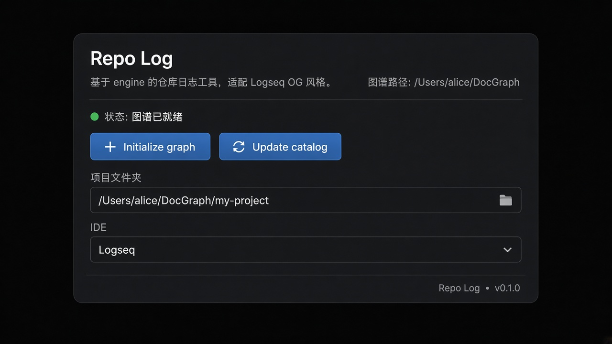

# Repo Log

**Logseq plugin** = buttons and settings. **Python engine** = writes pages. **Logseq OG** = browse the graph.

This repository is the sidecar engine plus a Logseq OG plugin adapter. The plugin does **not** fork Logseq and does **not** implement a second capture/catalog write path. Pages are written by `python -m repo_log serve` on `127.0.0.1:8765`.

Marketplace reviewers: plugin [`package.json`](plugin/package.json), MIT [`plugin/LICENSE`](plugin/LICENSE), and [`.github/workflows/publish.yml`](.github/workflows/publish.yml). Release zip: [v0.1.0](https://github.com/MLEDss/repo-log/releases/tag/v0.1.0).

## Install

Marketplace listing is submitted: [logseq/marketplace#900](https://github.com/logseq/marketplace/pull/900). After that PR is merged, install from Logseq → Plugins → Marketplace → **Repo Log**, then still run the engine from this repo.

Until the PR is merged:

1. Double-click `repo-log.cmd` (engine at `http://127.0.0.1:8765`; leave it running).
2. Open Logseq OG on this repo’s `out/notes` (`python -m repo_log init` once).
3. `cd plugin && npm install && npm run build`
4. Developer mode → Plugins → **Load unpacked plugin** → `plugin/`
5. Toolbar **RL**

Plugin details, slash commands, and screenshots: [`plugin/README.md`](plugin/README.md).

Release zip: [v0.1.0](https://github.com/MLEDss/repo-log/releases/tag/v0.1.0) (`logseq-plugin-repo-log-v0.1.0.zip`).

Fallback window: `.\repo-log.ps1 app`.
